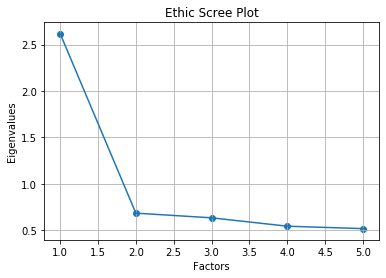
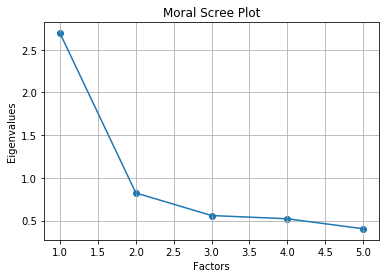
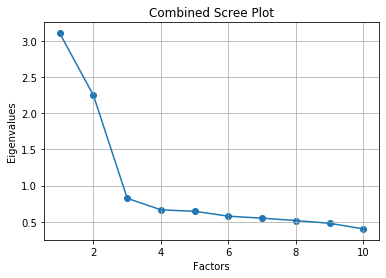

# YADDAT: Yet Another D&D Alignment Test

Web App: [**YADDAT**](https://austin-routt.github.io/YADDAT/)    
**Questions/Items:** 10    
**Unidimensional Constructs:** Ethics and Morality    
**Ethics Scale Cronbach's alpha:** 77.2%    
**Morality Scale Cronbach's alpha:** 78.4%    
**Cumulative Variance:** 42.12%     


To take the test, click on the link above. What follows is a walkthrough of YADDAT's development.  

## Introduction
As my starting point, I searched through the AB5C subset of the [IPIP](https://ipip.ori.org/) to find potential questions for YADDAT. I took all items that felt appropriate to measure ethic and moral scales, as defined by my interpretation of D&D [alignment](https://dungeonsdragons.fandom.com/wiki/Alignment).  Item response [data](https://dataverse.harvard.edu/file.xhtml?persistentId=doi:10.7910/DVN/UF52WY/EYX80C&version=1.0) from the **Eugene-Springfield Community Sample** was then downloaded for data analysis.

Now that's established, I'll load the data and clean it.  Once properly cleaned and formatted, I will test the **validity** and **internal consistency** of YADDAT's ethic and moral scales via [**Cronbach's alpha**](https://www.ncbi.nlm.nih.gov/pmc/articles/PMC4205511/) and [**Factor Analysis**](https://en.wikipedia.org/wiki/Factor_analysis). 

## Cleaning the Data

First, all of the required packages need to be imported


```python
#Required Imports
import numpy as np
import pandas as pd
from factor_analyzer import FactorAnalyzer
from factor_analyzer.factor_analyzer import calculate_kmo
from factor_analyzer.factor_analyzer import calculate_bartlett_sphericity
import matplotlib.pyplot as plt
import tabulate
from IPython.display import display, HTML, Markdown, Latex
```

Next, the question and response files are loaded


```python
#Load the raw data

#1:The Questions

#Read in the excel file
xls = pd.ExcelFile("ScalesFor967items.xls")

#Parse the sheet of interest into a dataframe
df_q = xls.parse(0) 


#2:The Answers

# Read the tab delimited file into a dataframe
filename = 'IPIP2539-1.tab'
df_a = pd.read_csv(filename, sep='\t', engine='python')

#Preview Data.
display(df_q, df_a)
```


<div>
<table border="1" class="dataframe">
  <thead>
    <tr style="text-align: right;">
      <th></th>
      <th>Item Num</th>
      <th>Item</th>
      <th>N_Scales</th>
      <th>Big5</th>
      <th>B5sgn</th>
      <th>Seven Factor</th>
      <th>SEVsgn</th>
      <th>AB5C</th>
      <th>AB5sgn</th>
      <th>NEO Domain</th>
      <th>...</th>
      <th>The 16PF</th>
      <th>PFsgn</th>
      <th>JPIR</th>
      <th>JPIsgn</th>
      <th>Six FPQ</th>
      <th>FPQsgn</th>
      <th>MPQ</th>
      <th>MPQsgn</th>
      <th>Emot_Int</th>
      <th>EMOTsgn</th>
    </tr>
  </thead>
  <tbody>
    <tr>
      <th>0</th>
      <td>H133</td>
      <td>Accept apologies easily.</td>
      <td>1</td>
      <td>NaN</td>
      <td>NaN</td>
      <td>NaN</td>
      <td>NaN</td>
      <td>NaN</td>
      <td>NaN</td>
      <td>NaN</td>
      <td>...</td>
      <td>NaN</td>
      <td>NaN</td>
      <td>NaN</td>
      <td>NaN</td>
      <td>NaN</td>
      <td>NaN</td>
      <td>NaN</td>
      <td>NaN</td>
      <td>NaN</td>
      <td>NaN</td>
    </tr>
    <tr>
      <th>1</th>
      <td>H515</td>
      <td>Accept challenging tasks.</td>
      <td>2</td>
      <td>NaN</td>
      <td>NaN</td>
      <td>NaN</td>
      <td>NaN</td>
      <td>NaN</td>
      <td>NaN</td>
      <td>NaN</td>
      <td>...</td>
      <td>NaN</td>
      <td>NaN</td>
      <td>NaN</td>
      <td>NaN</td>
      <td>NaN</td>
      <td>NaN</td>
      <td>NaN</td>
      <td>NaN</td>
      <td>NaN</td>
      <td>NaN</td>
    </tr>
    <tr>
      <th>2</th>
      <td>H139</td>
      <td>Accept others' weaknesses.</td>
      <td>1</td>
      <td>NaN</td>
      <td>NaN</td>
      <td>NaN</td>
      <td>NaN</td>
      <td>NaN</td>
      <td>NaN</td>
      <td>NaN</td>
      <td>...</td>
      <td>NaN</td>
      <td>NaN</td>
      <td>NaN</td>
      <td>NaN</td>
      <td>NaN</td>
      <td>NaN</td>
      <td>NaN</td>
      <td>NaN</td>
      <td>NaN</td>
      <td>NaN</td>
    </tr>
    <tr>
      <th>3</th>
      <td>H106</td>
      <td>Accept people as they are.</td>
      <td>6</td>
      <td>NaN</td>
      <td>NaN</td>
      <td>NaN</td>
      <td>NaN</td>
      <td>IV+II+</td>
      <td>NaN</td>
      <td>A</td>
      <td>...</td>
      <td>NaN</td>
      <td>NaN</td>
      <td>NaN</td>
      <td>NaN</td>
      <td>Agreeableness</td>
      <td>NaN</td>
      <td>NaN</td>
      <td>NaN</td>
      <td>NaN</td>
      <td>NaN</td>
    </tr>
    <tr>
      <th>4</th>
      <td>H554</td>
      <td>Accomplish a lot of work.</td>
      <td>4</td>
      <td>NaN</td>
      <td>NaN</td>
      <td>NaN</td>
      <td>NaN</td>
      <td>NaN</td>
      <td>NaN</td>
      <td>NaN</td>
      <td>...</td>
      <td>NaN</td>
      <td>NaN</td>
      <td>Energy Level</td>
      <td>NaN</td>
      <td>Achievement</td>
      <td>NaN</td>
      <td>NaN</td>
      <td>NaN</td>
      <td>NaN</td>
      <td>NaN</td>
    </tr>
    <tr>
      <th>...</th>
      <td>...</td>
      <td>...</td>
      <td>...</td>
      <td>...</td>
      <td>...</td>
      <td>...</td>
      <td>...</td>
      <td>...</td>
      <td>...</td>
      <td>...</td>
      <td>...</td>
      <td>...</td>
      <td>...</td>
      <td>...</td>
      <td>...</td>
      <td>...</td>
      <td>...</td>
      <td>...</td>
      <td>...</td>
      <td>...</td>
      <td>...</td>
    </tr>
    <tr>
      <th>962</th>
      <td>E71</td>
      <td>Would never make a high risk investment.</td>
      <td>3</td>
      <td>NaN</td>
      <td>NaN</td>
      <td>NaN</td>
      <td>NaN</td>
      <td>NaN</td>
      <td>NaN</td>
      <td>NaN</td>
      <td>...</td>
      <td>NaN</td>
      <td>NaN</td>
      <td>Risk Taking</td>
      <td>-</td>
      <td>NaN</td>
      <td>NaN</td>
      <td>HA</td>
      <td>NaN</td>
      <td>NaN</td>
      <td>NaN</td>
    </tr>
    <tr>
      <th>963</th>
      <td>P367</td>
      <td>Would never take things that aren't mine.</td>
      <td>2</td>
      <td>NaN</td>
      <td>NaN</td>
      <td>NaN</td>
      <td>NaN</td>
      <td>NaN</td>
      <td>NaN</td>
      <td>NaN</td>
      <td>...</td>
      <td>NaN</td>
      <td>NaN</td>
      <td>Responsibility</td>
      <td>NaN</td>
      <td>NaN</td>
      <td>NaN</td>
      <td>AG</td>
      <td>-</td>
      <td>NaN</td>
      <td>NaN</td>
    </tr>
    <tr>
      <th>964</th>
      <td>P485</td>
      <td>Would not be a good comedian.</td>
      <td>1</td>
      <td>NaN</td>
      <td>NaN</td>
      <td>NaN</td>
      <td>NaN</td>
      <td>NaN</td>
      <td>NaN</td>
      <td>NaN</td>
      <td>...</td>
      <td>NaN</td>
      <td>NaN</td>
      <td>NaN</td>
      <td>NaN</td>
      <td>Exhibition</td>
      <td>-</td>
      <td>NaN</td>
      <td>NaN</td>
      <td>NaN</td>
      <td>NaN</td>
    </tr>
    <tr>
      <th>965</th>
      <td>H142</td>
      <td>Wouldn't harm a fly.</td>
      <td>1</td>
      <td>NaN</td>
      <td>NaN</td>
      <td>NaN</td>
      <td>NaN</td>
      <td>II+V-</td>
      <td>NaN</td>
      <td>NaN</td>
      <td>...</td>
      <td>NaN</td>
      <td>NaN</td>
      <td>NaN</td>
      <td>NaN</td>
      <td>NaN</td>
      <td>NaN</td>
      <td>NaN</td>
      <td>NaN</td>
      <td>NaN</td>
      <td>NaN</td>
    </tr>
    <tr>
      <th>966</th>
      <td>H809</td>
      <td>Yell at people.</td>
      <td>2</td>
      <td>NaN</td>
      <td>NaN</td>
      <td>NaN</td>
      <td>NaN</td>
      <td>NaN</td>
      <td>NaN</td>
      <td>NaN</td>
      <td>...</td>
      <td>NaN</td>
      <td>NaN</td>
      <td>NaN</td>
      <td>NaN</td>
      <td>NaN</td>
      <td>NaN</td>
      <td>NaN</td>
      <td>NaN</td>
      <td>NaN</td>
      <td>NaN</td>
    </tr>
  </tbody>
</table>
<p>967 rows × 31 columns</p>
</div>


<div>
<table border="1" class="dataframe">
  <thead>
    <tr style="text-align: right;">
      <th></th>
      <th>ID</th>
      <th>A1</th>
      <th>A10</th>
      <th>A100</th>
      <th>A101</th>
      <th>A102</th>
      <th>A103</th>
      <th>A104</th>
      <th>A105</th>
      <th>A106</th>
      <th>...</th>
      <th>X89</th>
      <th>X90</th>
      <th>X91</th>
      <th>X92</th>
      <th>X93</th>
      <th>X95</th>
      <th>X96</th>
      <th>X97</th>
      <th>X98</th>
      <th>X99</th>
    </tr>
  </thead>
  <tbody>
    <tr>
      <th>0</th>
      <td>1001</td>
      <td>NaN</td>
      <td>NaN</td>
      <td>NaN</td>
      <td>NaN</td>
      <td>NaN</td>
      <td>NaN</td>
      <td>NaN</td>
      <td>NaN</td>
      <td>NaN</td>
      <td>...</td>
      <td>2.0</td>
      <td>3.0</td>
      <td>1.0</td>
      <td>4.0</td>
      <td>2.0</td>
      <td>2.0</td>
      <td>4.0</td>
      <td>2.0</td>
      <td>5.0</td>
      <td>4.0</td>
    </tr>
    <tr>
      <th>1</th>
      <td>1002</td>
      <td>NaN</td>
      <td>NaN</td>
      <td>NaN</td>
      <td>NaN</td>
      <td>NaN</td>
      <td>NaN</td>
      <td>NaN</td>
      <td>NaN</td>
      <td>NaN</td>
      <td>...</td>
      <td>1.0</td>
      <td>4.0</td>
      <td>1.0</td>
      <td>3.0</td>
      <td>1.0</td>
      <td>2.0</td>
      <td>4.0</td>
      <td>4.0</td>
      <td>5.0</td>
      <td>3.0</td>
    </tr>
    <tr>
      <th>2</th>
      <td>1003</td>
      <td>3.0</td>
      <td>2.0</td>
      <td>4.0</td>
      <td>3.0</td>
      <td>3.0</td>
      <td>1.0</td>
      <td>1.0</td>
      <td>1.0</td>
      <td>2.0</td>
      <td>...</td>
      <td>5.0</td>
      <td>3.0</td>
      <td>2.0</td>
      <td>3.0</td>
      <td>4.0</td>
      <td>3.0</td>
      <td>3.0</td>
      <td>2.0</td>
      <td>4.0</td>
      <td>2.0</td>
    </tr>
    <tr>
      <th>3</th>
      <td>1004</td>
      <td>5.0</td>
      <td>2.0</td>
      <td>4.0</td>
      <td>4.0</td>
      <td>2.0</td>
      <td>1.0</td>
      <td>1.0</td>
      <td>2.0</td>
      <td>1.0</td>
      <td>...</td>
      <td>4.0</td>
      <td>4.0</td>
      <td>2.0</td>
      <td>3.0</td>
      <td>1.0</td>
      <td>2.0</td>
      <td>4.0</td>
      <td>2.0</td>
      <td>5.0</td>
      <td>4.0</td>
    </tr>
    <tr>
      <th>4</th>
      <td>1005</td>
      <td>5.0</td>
      <td>4.0</td>
      <td>4.0</td>
      <td>4.0</td>
      <td>2.0</td>
      <td>1.0</td>
      <td>1.0</td>
      <td>1.0</td>
      <td>2.0</td>
      <td>...</td>
      <td>3.0</td>
      <td>3.0</td>
      <td>1.0</td>
      <td>4.0</td>
      <td>1.0</td>
      <td>2.0</td>
      <td>4.0</td>
      <td>2.0</td>
      <td>5.0</td>
      <td>5.0</td>
    </tr>
    <tr>
      <th>...</th>
      <td>...</td>
      <td>...</td>
      <td>...</td>
      <td>...</td>
      <td>...</td>
      <td>...</td>
      <td>...</td>
      <td>...</td>
      <td>...</td>
      <td>...</td>
      <td>...</td>
      <td>...</td>
      <td>...</td>
      <td>...</td>
      <td>...</td>
      <td>...</td>
      <td>...</td>
      <td>...</td>
      <td>...</td>
      <td>...</td>
      <td>...</td>
    </tr>
    <tr>
      <th>1137</th>
      <td>2462</td>
      <td>3.0</td>
      <td>4.0</td>
      <td>2.0</td>
      <td>3.0</td>
      <td>2.0</td>
      <td>1.0</td>
      <td>1.0</td>
      <td>1.0</td>
      <td>2.0</td>
      <td>...</td>
      <td>3.0</td>
      <td>3.0</td>
      <td>3.0</td>
      <td>4.0</td>
      <td>4.0</td>
      <td>2.0</td>
      <td>5.0</td>
      <td>1.0</td>
      <td>3.0</td>
      <td>1.0</td>
    </tr>
    <tr>
      <th>1138</th>
      <td>2463</td>
      <td>NaN</td>
      <td>NaN</td>
      <td>NaN</td>
      <td>NaN</td>
      <td>NaN</td>
      <td>NaN</td>
      <td>NaN</td>
      <td>NaN</td>
      <td>NaN</td>
      <td>...</td>
      <td>NaN</td>
      <td>NaN</td>
      <td>NaN</td>
      <td>NaN</td>
      <td>NaN</td>
      <td>NaN</td>
      <td>NaN</td>
      <td>NaN</td>
      <td>NaN</td>
      <td>NaN</td>
    </tr>
    <tr>
      <th>1139</th>
      <td>2464</td>
      <td>5.0</td>
      <td>2.0</td>
      <td>3.0</td>
      <td>4.0</td>
      <td>4.0</td>
      <td>3.0</td>
      <td>1.0</td>
      <td>1.0</td>
      <td>5.0</td>
      <td>...</td>
      <td>2.0</td>
      <td>2.0</td>
      <td>1.0</td>
      <td>4.0</td>
      <td>2.0</td>
      <td>3.0</td>
      <td>4.0</td>
      <td>3.0</td>
      <td>3.0</td>
      <td>4.0</td>
    </tr>
    <tr>
      <th>1140</th>
      <td>2465</td>
      <td>NaN</td>
      <td>NaN</td>
      <td>NaN</td>
      <td>NaN</td>
      <td>NaN</td>
      <td>NaN</td>
      <td>NaN</td>
      <td>NaN</td>
      <td>NaN</td>
      <td>...</td>
      <td>NaN</td>
      <td>NaN</td>
      <td>NaN</td>
      <td>NaN</td>
      <td>NaN</td>
      <td>NaN</td>
      <td>NaN</td>
      <td>NaN</td>
      <td>NaN</td>
      <td>NaN</td>
    </tr>
    <tr>
      <th>1141</th>
      <td>2466</td>
      <td>NaN</td>
      <td>NaN</td>
      <td>NaN</td>
      <td>NaN</td>
      <td>NaN</td>
      <td>NaN</td>
      <td>NaN</td>
      <td>NaN</td>
      <td>NaN</td>
      <td>...</td>
      <td>NaN</td>
      <td>NaN</td>
      <td>NaN</td>
      <td>NaN</td>
      <td>NaN</td>
      <td>NaN</td>
      <td>NaN</td>
      <td>NaN</td>
      <td>NaN</td>
      <td>NaN</td>
    </tr>
  </tbody>
</table>
<p>1142 rows × 2540 columns</p>
</div>


Create lists of question item numbers that represent the constructs of ethics and morality. Also, define the items that are negatively keyed.


```python
#Define YADDAT 0.01 through ethic (Law-Chaos) and moral (Good-Evil) constructs

#Create lists for the chosen ethics and morality items. Also, create a combined list.
ethicItems_0 = ['X136','X150','H296','H575','H1346','H498','H579','E122','X118','H309','H215','H941','H250','H1327','H400','E7','E146','X274','X146','H925','X77','X204','H1140','H294','H170','E52','X263','E35','H88','H1351','X173','H870','E46','H1350','H303','X122','H926']
moralItems_0 = ['H794','H1328', 'H1100', 'X253', 'H714', 'H29','H1130','X259','H183','H198','E115','X70','H126','X203','X244','X210','H33','X113','H159','H105','H792','E166','H22','X177','H153','H435','E121','H98','H109', 'H721', 'X227', 'X185']
YADDATItems_0 = ethicItems_0+moralItems_0

#Define which items are negative
negativeEthicItems = ['H575','H1346','H498','H579','E122','H941','H1327','H400','E7','E146','H925','X204','H1140','E35','H88','H870','E46','X122','H926']
negativeMoralItems = ['H794','H1328','H714','X70','X203','X244','X210','X113','H792','E166','H435','E121','H98','H721','X227','X185']
negativeItems = negativeEthicItems+negativeMoralItems
```

Now, we'll make the initial YADDAT item pool from appropriate questions taken from the AB5C subset of the question data.


```python
#Create a list of columns for the AB5C data
AB5CList = ['Item Num', 'Item', 'AB5C']

#Create the AB5C dataframe, dropping rows with missing data
AB5C = df_q[AB5CList].dropna(axis=0, how='any')

#Create YADDAT 0.01 by filtering the items using the YADDATItems_0 list
YADDAT_0 = AB5C[AB5C['Item Num'].isin(YADDATItems_0)]

#Set the 'Item Num' column as the dataframe index
YADDAT_0 = YADDAT_0.set_index('Item Num')

#Display YADDAT 0.01
display(YADDAT_0)
```


<div>
<table border="1" class="dataframe">
  <thead>
    <tr style="text-align: right;">
      <th></th>
      <th>Item</th>
      <th>AB5C</th>
    </tr>
    <tr>
      <th>Item Num</th>
      <th></th>
      <th></th>
    </tr>
  </thead>
  <tbody>
    <tr>
      <th>H794</th>
      <td>Act at the expense of others.</td>
      <td>II+III+</td>
    </tr>
    <tr>
      <th>H1100</th>
      <td>Am concerned about others.</td>
      <td>II+III-</td>
    </tr>
    <tr>
      <th>X253</th>
      <td>Am deeply moved by others' misfortunes.</td>
      <td>II+III-</td>
    </tr>
    <tr>
      <th>H941</th>
      <td>Am guided by my moods.</td>
      <td>IV+III+</td>
    </tr>
    <tr>
      <th>X203</th>
      <td>Am indifferent to the feelings of others.</td>
      <td>II+II+</td>
    </tr>
    <tr>
      <th>...</th>
      <td>...</td>
      <td>...</td>
    </tr>
    <tr>
      <th>X150</th>
      <td>Try to follow the rules.</td>
      <td>II+III+</td>
    </tr>
    <tr>
      <th>H170</th>
      <td>Wait for my turn.</td>
      <td>I+II-</td>
    </tr>
    <tr>
      <th>H303</th>
      <td>Want things to proceed according to plan.</td>
      <td>III+IV-</td>
    </tr>
    <tr>
      <th>H198</th>
      <td>Will do anything for others.</td>
      <td>II+V-</td>
    </tr>
    <tr>
      <th>X136</th>
      <td>Would never cheat on my taxes.</td>
      <td>II+III+</td>
    </tr>
  </tbody>
</table>
<p>69 rows × 2 columns</p>
</div>


Following that, a dataframe is created for item responses of YADDAT.


```python
#Create a combined dataframe for ethical and moral constructs
combinedDF_0 = df_a[YADDATItems_0]

#Delete rows that have at least 1 missing value
combinedDF_1 = combinedDF_0.dropna(axis=0, how='any')

#Convert float to int
combinedDF_1 = combinedDF_1[YADDATItems_0].astype(int)

#Preview the dataframes
display(combinedDF_1)
```


<div>
<table border="1" class="dataframe">
  <thead>
    <tr style="text-align: right;">
      <th></th>
      <th>X136</th>
      <th>X150</th>
      <th>H296</th>
      <th>H575</th>
      <th>H1346</th>
      <th>H498</th>
      <th>H579</th>
      <th>E122</th>
      <th>X118</th>
      <th>H309</th>
      <th>...</th>
      <th>H22</th>
      <th>X177</th>
      <th>H153</th>
      <th>H435</th>
      <th>E121</th>
      <th>H98</th>
      <th>H109</th>
      <th>H721</th>
      <th>X227</th>
      <th>X185</th>
    </tr>
  </thead>
  <tbody>
    <tr>
      <th>2</th>
      <td>3</td>
      <td>3</td>
      <td>2</td>
      <td>2</td>
      <td>4</td>
      <td>3</td>
      <td>3</td>
      <td>3</td>
      <td>4</td>
      <td>2</td>
      <td>...</td>
      <td>3</td>
      <td>1</td>
      <td>4</td>
      <td>1</td>
      <td>2</td>
      <td>4</td>
      <td>4</td>
      <td>1</td>
      <td>1</td>
      <td>2</td>
    </tr>
    <tr>
      <th>3</th>
      <td>4</td>
      <td>4</td>
      <td>4</td>
      <td>1</td>
      <td>1</td>
      <td>3</td>
      <td>1</td>
      <td>2</td>
      <td>4</td>
      <td>4</td>
      <td>...</td>
      <td>4</td>
      <td>4</td>
      <td>5</td>
      <td>2</td>
      <td>2</td>
      <td>1</td>
      <td>5</td>
      <td>1</td>
      <td>1</td>
      <td>2</td>
    </tr>
    <tr>
      <th>4</th>
      <td>5</td>
      <td>5</td>
      <td>5</td>
      <td>1</td>
      <td>1</td>
      <td>4</td>
      <td>1</td>
      <td>1</td>
      <td>5</td>
      <td>4</td>
      <td>...</td>
      <td>5</td>
      <td>5</td>
      <td>4</td>
      <td>4</td>
      <td>1</td>
      <td>1</td>
      <td>5</td>
      <td>2</td>
      <td>1</td>
      <td>2</td>
    </tr>
    <tr>
      <th>6</th>
      <td>4</td>
      <td>4</td>
      <td>4</td>
      <td>3</td>
      <td>4</td>
      <td>3</td>
      <td>1</td>
      <td>4</td>
      <td>4</td>
      <td>4</td>
      <td>...</td>
      <td>4</td>
      <td>4</td>
      <td>5</td>
      <td>4</td>
      <td>3</td>
      <td>4</td>
      <td>5</td>
      <td>3</td>
      <td>4</td>
      <td>4</td>
    </tr>
    <tr>
      <th>7</th>
      <td>4</td>
      <td>4</td>
      <td>4</td>
      <td>2</td>
      <td>2</td>
      <td>3</td>
      <td>2</td>
      <td>2</td>
      <td>4</td>
      <td>3</td>
      <td>...</td>
      <td>4</td>
      <td>4</td>
      <td>5</td>
      <td>2</td>
      <td>2</td>
      <td>2</td>
      <td>4</td>
      <td>4</td>
      <td>2</td>
      <td>4</td>
    </tr>
    <tr>
      <th>...</th>
      <td>...</td>
      <td>...</td>
      <td>...</td>
      <td>...</td>
      <td>...</td>
      <td>...</td>
      <td>...</td>
      <td>...</td>
      <td>...</td>
      <td>...</td>
      <td>...</td>
      <td>...</td>
      <td>...</td>
      <td>...</td>
      <td>...</td>
      <td>...</td>
      <td>...</td>
      <td>...</td>
      <td>...</td>
      <td>...</td>
      <td>...</td>
    </tr>
    <tr>
      <th>1124</th>
      <td>2</td>
      <td>4</td>
      <td>3</td>
      <td>2</td>
      <td>2</td>
      <td>2</td>
      <td>1</td>
      <td>3</td>
      <td>2</td>
      <td>3</td>
      <td>...</td>
      <td>5</td>
      <td>5</td>
      <td>4</td>
      <td>4</td>
      <td>1</td>
      <td>3</td>
      <td>5</td>
      <td>2</td>
      <td>1</td>
      <td>2</td>
    </tr>
    <tr>
      <th>1125</th>
      <td>5</td>
      <td>5</td>
      <td>5</td>
      <td>1</td>
      <td>1</td>
      <td>1</td>
      <td>1</td>
      <td>4</td>
      <td>5</td>
      <td>5</td>
      <td>...</td>
      <td>4</td>
      <td>5</td>
      <td>5</td>
      <td>4</td>
      <td>1</td>
      <td>4</td>
      <td>5</td>
      <td>1</td>
      <td>1</td>
      <td>4</td>
    </tr>
    <tr>
      <th>1129</th>
      <td>2</td>
      <td>3</td>
      <td>2</td>
      <td>2</td>
      <td>2</td>
      <td>5</td>
      <td>3</td>
      <td>2</td>
      <td>2</td>
      <td>2</td>
      <td>...</td>
      <td>3</td>
      <td>5</td>
      <td>5</td>
      <td>1</td>
      <td>1</td>
      <td>1</td>
      <td>4</td>
      <td>3</td>
      <td>1</td>
      <td>3</td>
    </tr>
    <tr>
      <th>1137</th>
      <td>4</td>
      <td>4</td>
      <td>4</td>
      <td>1</td>
      <td>2</td>
      <td>2</td>
      <td>1</td>
      <td>4</td>
      <td>4</td>
      <td>4</td>
      <td>...</td>
      <td>4</td>
      <td>3</td>
      <td>4</td>
      <td>2</td>
      <td>1</td>
      <td>2</td>
      <td>5</td>
      <td>4</td>
      <td>2</td>
      <td>3</td>
    </tr>
    <tr>
      <th>1139</th>
      <td>4</td>
      <td>3</td>
      <td>5</td>
      <td>2</td>
      <td>2</td>
      <td>3</td>
      <td>1</td>
      <td>4</td>
      <td>4</td>
      <td>4</td>
      <td>...</td>
      <td>4</td>
      <td>4</td>
      <td>4</td>
      <td>1</td>
      <td>2</td>
      <td>1</td>
      <td>5</td>
      <td>2</td>
      <td>2</td>
      <td>4</td>
    </tr>
  </tbody>
</table>
<p>570 rows × 69 columns</p>
</div>


Since the data consists of raw item responses, scoring must commence. Like the AB5C, both of YADDAT's scales have positively and negatively framed questions. Positive item responses remain unchanged, but responses associated with negative items will need to be reversed (i.e. 1 &#8594; 5, 2 &#8594; 4, 3 &#8594; 3, 4 &#8594; 2, and 5 &#8594; 1)


```python
#Define a key to negative items
revrs = {1: 5, 2: 4, 3: 3, 4: 2, 5: 1}

#Reverse score negative columns using the key
combinedDF_2 = combinedDF_1
combinedDF_2[negativeItems] = combinedDF_2[negativeItems].replace(revrs) 


#Preview the new moral dataframe
display(combinedDF_2)
```


<div>
<table border="1" class="dataframe">
  <thead>
    <tr style="text-align: right;">
      <th></th>
      <th>X136</th>
      <th>X150</th>
      <th>H296</th>
      <th>H575</th>
      <th>H1346</th>
      <th>H498</th>
      <th>H579</th>
      <th>E122</th>
      <th>X118</th>
      <th>H309</th>
      <th>...</th>
      <th>H22</th>
      <th>X177</th>
      <th>H153</th>
      <th>H435</th>
      <th>E121</th>
      <th>H98</th>
      <th>H109</th>
      <th>H721</th>
      <th>X227</th>
      <th>X185</th>
    </tr>
  </thead>
  <tbody>
    <tr>
      <th>2</th>
      <td>3</td>
      <td>3</td>
      <td>2</td>
      <td>4</td>
      <td>2</td>
      <td>3</td>
      <td>3</td>
      <td>3</td>
      <td>4</td>
      <td>2</td>
      <td>...</td>
      <td>3</td>
      <td>1</td>
      <td>4</td>
      <td>5</td>
      <td>4</td>
      <td>2</td>
      <td>4</td>
      <td>5</td>
      <td>5</td>
      <td>4</td>
    </tr>
    <tr>
      <th>3</th>
      <td>4</td>
      <td>4</td>
      <td>4</td>
      <td>5</td>
      <td>5</td>
      <td>3</td>
      <td>5</td>
      <td>4</td>
      <td>4</td>
      <td>4</td>
      <td>...</td>
      <td>4</td>
      <td>4</td>
      <td>5</td>
      <td>4</td>
      <td>4</td>
      <td>5</td>
      <td>5</td>
      <td>5</td>
      <td>5</td>
      <td>4</td>
    </tr>
    <tr>
      <th>4</th>
      <td>5</td>
      <td>5</td>
      <td>5</td>
      <td>5</td>
      <td>5</td>
      <td>2</td>
      <td>5</td>
      <td>5</td>
      <td>5</td>
      <td>4</td>
      <td>...</td>
      <td>5</td>
      <td>5</td>
      <td>4</td>
      <td>2</td>
      <td>5</td>
      <td>5</td>
      <td>5</td>
      <td>4</td>
      <td>5</td>
      <td>4</td>
    </tr>
    <tr>
      <th>6</th>
      <td>4</td>
      <td>4</td>
      <td>4</td>
      <td>3</td>
      <td>2</td>
      <td>3</td>
      <td>5</td>
      <td>2</td>
      <td>4</td>
      <td>4</td>
      <td>...</td>
      <td>4</td>
      <td>4</td>
      <td>5</td>
      <td>2</td>
      <td>3</td>
      <td>2</td>
      <td>5</td>
      <td>3</td>
      <td>2</td>
      <td>2</td>
    </tr>
    <tr>
      <th>7</th>
      <td>4</td>
      <td>4</td>
      <td>4</td>
      <td>4</td>
      <td>4</td>
      <td>3</td>
      <td>4</td>
      <td>4</td>
      <td>4</td>
      <td>3</td>
      <td>...</td>
      <td>4</td>
      <td>4</td>
      <td>5</td>
      <td>4</td>
      <td>4</td>
      <td>4</td>
      <td>4</td>
      <td>2</td>
      <td>4</td>
      <td>2</td>
    </tr>
    <tr>
      <th>...</th>
      <td>...</td>
      <td>...</td>
      <td>...</td>
      <td>...</td>
      <td>...</td>
      <td>...</td>
      <td>...</td>
      <td>...</td>
      <td>...</td>
      <td>...</td>
      <td>...</td>
      <td>...</td>
      <td>...</td>
      <td>...</td>
      <td>...</td>
      <td>...</td>
      <td>...</td>
      <td>...</td>
      <td>...</td>
      <td>...</td>
      <td>...</td>
    </tr>
    <tr>
      <th>1124</th>
      <td>2</td>
      <td>4</td>
      <td>3</td>
      <td>4</td>
      <td>4</td>
      <td>4</td>
      <td>5</td>
      <td>3</td>
      <td>2</td>
      <td>3</td>
      <td>...</td>
      <td>5</td>
      <td>5</td>
      <td>4</td>
      <td>2</td>
      <td>5</td>
      <td>3</td>
      <td>5</td>
      <td>4</td>
      <td>5</td>
      <td>4</td>
    </tr>
    <tr>
      <th>1125</th>
      <td>5</td>
      <td>5</td>
      <td>5</td>
      <td>5</td>
      <td>5</td>
      <td>5</td>
      <td>5</td>
      <td>2</td>
      <td>5</td>
      <td>5</td>
      <td>...</td>
      <td>4</td>
      <td>5</td>
      <td>5</td>
      <td>2</td>
      <td>5</td>
      <td>2</td>
      <td>5</td>
      <td>5</td>
      <td>5</td>
      <td>2</td>
    </tr>
    <tr>
      <th>1129</th>
      <td>2</td>
      <td>3</td>
      <td>2</td>
      <td>4</td>
      <td>4</td>
      <td>1</td>
      <td>3</td>
      <td>4</td>
      <td>2</td>
      <td>2</td>
      <td>...</td>
      <td>3</td>
      <td>5</td>
      <td>5</td>
      <td>5</td>
      <td>5</td>
      <td>5</td>
      <td>4</td>
      <td>3</td>
      <td>5</td>
      <td>3</td>
    </tr>
    <tr>
      <th>1137</th>
      <td>4</td>
      <td>4</td>
      <td>4</td>
      <td>5</td>
      <td>4</td>
      <td>4</td>
      <td>5</td>
      <td>2</td>
      <td>4</td>
      <td>4</td>
      <td>...</td>
      <td>4</td>
      <td>3</td>
      <td>4</td>
      <td>4</td>
      <td>5</td>
      <td>4</td>
      <td>5</td>
      <td>2</td>
      <td>4</td>
      <td>3</td>
    </tr>
    <tr>
      <th>1139</th>
      <td>4</td>
      <td>3</td>
      <td>5</td>
      <td>4</td>
      <td>4</td>
      <td>3</td>
      <td>5</td>
      <td>2</td>
      <td>4</td>
      <td>4</td>
      <td>...</td>
      <td>4</td>
      <td>4</td>
      <td>4</td>
      <td>5</td>
      <td>4</td>
      <td>5</td>
      <td>5</td>
      <td>4</td>
      <td>4</td>
      <td>2</td>
    </tr>
  </tbody>
</table>
<p>570 rows × 69 columns</p>
</div>


Now the constructs will be purified with an initial factor analysis, assuming only two factors exist.


```python
# Create a factor analysis object and perform factor analysis to divide items into 2 factors (i.e. the 2 constructs)
combinedfa = FactorAnalyzer(rotation="varimax", n_factors=2)

# Get the factor loadings
combinedfa.fit(combinedDF_2)

# New headings
H = ["Item Num","factor1", "factor2", "factor3", "factor4", "factor5", "factor6", "factor7", "factor8", "factor9", "factor10","factor11", "factor12", "factor13", "factor14", "factor15", "factor16", "factor17"]
display(HTML(tabulate.tabulate(combinedfa.loadings_, headers=H,showindex=YADDATItems_0, tablefmt='html')))
```


<table>
<thead>
<tr><th>Item Num  </th><th style="text-align: right;">    factor1</th><th style="text-align: right;">    factor2</th></tr>
</thead>
<tbody>
<tr><td>X136      </td><td style="text-align: right;"> 0.395672  </td><td style="text-align: right;"> 0.204668  </td></tr>
<tr><td>X150      </td><td style="text-align: right;"> 0.603549  </td><td style="text-align: right;"> 0.107178  </td></tr>
<tr><td>H296      </td><td style="text-align: right;"> 0.584861  </td><td style="text-align: right;"> 0.174011  </td></tr>
<tr><td>H575      </td><td style="text-align: right;"> 0.488488  </td><td style="text-align: right;"> 0.161693  </td></tr>
<tr><td>H1346     </td><td style="text-align: right;"> 0.621517  </td><td style="text-align: right;"> 0.207049  </td></tr>
<tr><td>H498      </td><td style="text-align: right;"> 0.544435  </td><td style="text-align: right;"> 0.190837  </td></tr>
<tr><td>H579      </td><td style="text-align: right;"> 0.475155  </td><td style="text-align: right;"> 0.258822  </td></tr>
<tr><td>E122      </td><td style="text-align: right;"> 0.413292  </td><td style="text-align: right;">-0.102627  </td></tr>
<tr><td>X118      </td><td style="text-align: right;"> 0.442331  </td><td style="text-align: right;">-0.0952163 </td></tr>
<tr><td>H309      </td><td style="text-align: right;"> 0.434376  </td><td style="text-align: right;">-0.129043  </td></tr>
<tr><td>H215      </td><td style="text-align: right;"> 0.545807  </td><td style="text-align: right;"> 0.102813  </td></tr>
<tr><td>H941      </td><td style="text-align: right;"> 0.298774  </td><td style="text-align: right;"> 0.0804836 </td></tr>
<tr><td>H250      </td><td style="text-align: right;"> 0.563901  </td><td style="text-align: right;">-0.126527  </td></tr>
<tr><td>H1327     </td><td style="text-align: right;"> 0.430348  </td><td style="text-align: right;"> 0.218139  </td></tr>
<tr><td>H400      </td><td style="text-align: right;"> 0.0853222 </td><td style="text-align: right;"> 0.129469  </td></tr>
<tr><td>E7        </td><td style="text-align: right;"> 0.292359  </td><td style="text-align: right;">-0.0306845 </td></tr>
<tr><td>E146      </td><td style="text-align: right;"> 0.212229  </td><td style="text-align: right;">-0.190461  </td></tr>
<tr><td>X274      </td><td style="text-align: right;"> 0.324381  </td><td style="text-align: right;"> 0.0520667 </td></tr>
<tr><td>X146      </td><td style="text-align: right;"> 0.270303  </td><td style="text-align: right;"> 0.134647  </td></tr>
<tr><td>H925      </td><td style="text-align: right;"> 0.385936  </td><td style="text-align: right;"> 0.199028  </td></tr>
<tr><td>X77       </td><td style="text-align: right;"> 0.249887  </td><td style="text-align: right;">-0.265739  </td></tr>
<tr><td>X204      </td><td style="text-align: right;"> 0.343854  </td><td style="text-align: right;">-0.129443  </td></tr>
<tr><td>H1140     </td><td style="text-align: right;"> 0.409736  </td><td style="text-align: right;"> 0.108018  </td></tr>
<tr><td>H294      </td><td style="text-align: right;"> 0.562237  </td><td style="text-align: right;"> 0.116925  </td></tr>
<tr><td>H170      </td><td style="text-align: right;"> 0.240549  </td><td style="text-align: right;"> 0.189156  </td></tr>
<tr><td>E52       </td><td style="text-align: right;"> 0.28352   </td><td style="text-align: right;">-0.210298  </td></tr>
<tr><td>X263      </td><td style="text-align: right;"> 0.420976  </td><td style="text-align: right;">-0.0323712 </td></tr>
<tr><td>E35       </td><td style="text-align: right;"> 0.400984  </td><td style="text-align: right;"> 0.138706  </td></tr>
<tr><td>H88       </td><td style="text-align: right;"> 0.461907  </td><td style="text-align: right;"> 0.164924  </td></tr>
<tr><td>H1351     </td><td style="text-align: right;"> 0.384341  </td><td style="text-align: right;">-0.0584686 </td></tr>
<tr><td>X173      </td><td style="text-align: right;"> 0.147667  </td><td style="text-align: right;">-0.363188  </td></tr>
<tr><td>H870      </td><td style="text-align: right;"> 0.442654  </td><td style="text-align: right;">-0.00566036</td></tr>
<tr><td>E46       </td><td style="text-align: right;"> 0.451923  </td><td style="text-align: right;"> 0.0356888 </td></tr>
<tr><td>H1350     </td><td style="text-align: right;"> 0.305014  </td><td style="text-align: right;">-0.0499739 </td></tr>
<tr><td>H303      </td><td style="text-align: right;"> 0.344134  </td><td style="text-align: right;">-0.178281  </td></tr>
<tr><td>X122      </td><td style="text-align: right;"> 0.459761  </td><td style="text-align: right;">-0.00292155</td></tr>
<tr><td>H926      </td><td style="text-align: right;"> 0.310746  </td><td style="text-align: right;"> 0.142814  </td></tr>
<tr><td>H794      </td><td style="text-align: right;"> 0.350682  </td><td style="text-align: right;"> 0.324515  </td></tr>
<tr><td>H1328     </td><td style="text-align: right;"> 0.21744   </td><td style="text-align: right;"> 0.134178  </td></tr>
<tr><td>H1100     </td><td style="text-align: right;"> 0.10565   </td><td style="text-align: right;"> 0.583757  </td></tr>
<tr><td>X253      </td><td style="text-align: right;"> 0.022114  </td><td style="text-align: right;"> 0.522004  </td></tr>
<tr><td>H714      </td><td style="text-align: right;"> 0.280332  </td><td style="text-align: right;"> 0.294009  </td></tr>
<tr><td>H29       </td><td style="text-align: right;"> 0.0438235 </td><td style="text-align: right;"> 0.280241  </td></tr>
<tr><td>H1130     </td><td style="text-align: right;"> 0.0701168 </td><td style="text-align: right;"> 0.599271  </td></tr>
<tr><td>X259      </td><td style="text-align: right;">-0.111705  </td><td style="text-align: right;"> 0.485313  </td></tr>
<tr><td>H183      </td><td style="text-align: right;"> 0.127353  </td><td style="text-align: right;"> 0.468109  </td></tr>
<tr><td>H198      </td><td style="text-align: right;"> 0.115477  </td><td style="text-align: right;"> 0.278378  </td></tr>
<tr><td>E115      </td><td style="text-align: right;">-0.0545162 </td><td style="text-align: right;"> 0.471778  </td></tr>
<tr><td>X70       </td><td style="text-align: right;">-0.1333    </td><td style="text-align: right;"> 0.3148    </td></tr>
<tr><td>H126      </td><td style="text-align: right;"> 0.272085  </td><td style="text-align: right;"> 0.364245  </td></tr>
<tr><td>X203      </td><td style="text-align: right;"> 0.0427275 </td><td style="text-align: right;"> 0.575583  </td></tr>
<tr><td>X244      </td><td style="text-align: right;"> 0.0470974 </td><td style="text-align: right;"> 0.640086  </td></tr>
<tr><td>X210      </td><td style="text-align: right;">-0.00802314</td><td style="text-align: right;"> 0.421597  </td></tr>
<tr><td>H33       </td><td style="text-align: right;"> 0.0666102 </td><td style="text-align: right;"> 0.20144   </td></tr>
<tr><td>X113      </td><td style="text-align: right;"> 0.0461261 </td><td style="text-align: right;"> 0.491368  </td></tr>
<tr><td>H159      </td><td style="text-align: right;"> 0.100371  </td><td style="text-align: right;"> 0.482613  </td></tr>
<tr><td>H105      </td><td style="text-align: right;"> 0.268681  </td><td style="text-align: right;"> 0.467005  </td></tr>
<tr><td>H792      </td><td style="text-align: right;"> 0.190279  </td><td style="text-align: right;"> 0.457251  </td></tr>
<tr><td>E166      </td><td style="text-align: right;"> 0.00340179</td><td style="text-align: right;"> 0.481038  </td></tr>
<tr><td>H22       </td><td style="text-align: right;"> 0.0804482 </td><td style="text-align: right;"> 0.420936  </td></tr>
<tr><td>X177      </td><td style="text-align: right;"> 0.0658016 </td><td style="text-align: right;"> 0.457669  </td></tr>
<tr><td>H153      </td><td style="text-align: right;"> 0.240701  </td><td style="text-align: right;"> 0.358694  </td></tr>
<tr><td>H435      </td><td style="text-align: right;">-0.010003  </td><td style="text-align: right;"> 0.423121  </td></tr>
<tr><td>E121      </td><td style="text-align: right;"> 0.0071875 </td><td style="text-align: right;"> 0.473733  </td></tr>
<tr><td>H98       </td><td style="text-align: right;"> 0.155329  </td><td style="text-align: right;"> 0.150402  </td></tr>
<tr><td>H109      </td><td style="text-align: right;"> 0.0847288 </td><td style="text-align: right;"> 0.496804  </td></tr>
<tr><td>H721      </td><td style="text-align: right;"> 0.175745  </td><td style="text-align: right;"> 0.301933  </td></tr>
<tr><td>X227      </td><td style="text-align: right;">-0.0567792 </td><td style="text-align: right;"> 0.642986  </td></tr>
<tr><td>X185      </td><td style="text-align: right;">-0.218897  </td><td style="text-align: right;"> 0.296432  </td></tr>
</tbody>
</table>


Using the factor loadings, we'll filter out questions that have an absolute correlation at or below 55%.


```python
# Create a dataframe from the factor loadings
dataframe=pd.DataFrame(combinedfa.loadings_,index=YADDATItems_0) 

# Only include items that have a factor coorelation greater than 50%.
highcorr = dataframe[abs(dataframe) >.55]

#Create a list to hold the high correlation items
highcorrItems = []

# Iterate over the index range from o to max number of factors in dataframe, in this case 2
for index in range(highcorr.shape[1]):
    print('Factor Number : ', index+1)
   # Select column by index position using iloc[]
    columnSeriesObj = highcorr.iloc[: , index].dropna()
   #Append to highcorrItems list
    highcorrItems.append(list(columnSeriesObj.index))
   #Display the factor
    display(YADDAT_0.loc[list(columnSeriesObj.index),:])
    print()
#Display item list
display(highcorrItems)
```

    Factor Number :  1
    


<div>

<table border="1" class="dataframe">
  <thead>
    <tr style="text-align: right;">
      <th></th>
      <th>Item</th>
      <th>AB5C</th>
    </tr>
    <tr>
      <th>Item Num</th>
      <th></th>
      <th></th>
    </tr>
  </thead>
  <tbody>
    <tr>
      <th>X150</th>
      <td>Try to follow the rules.</td>
      <td>II+III+</td>
    </tr>
    <tr>
      <th>H296</th>
      <td>Respect authority.</td>
      <td>II+III+</td>
    </tr>
    <tr>
      <th>H1346</th>
      <td>Break rules.</td>
      <td>II+III+</td>
    </tr>
    <tr>
      <th>H250</th>
      <td>Do things by the book.</td>
      <td>III+V-</td>
    </tr>
    <tr>
      <th>H294</th>
      <td>Stick to the rules.</td>
      <td>III+II+</td>
    </tr>
  </tbody>
</table>
</div>


    
    Factor Number :  2
    


<div>

<table border="1" class="dataframe">
  <thead>
    <tr style="text-align: right;">
      <th></th>
      <th>Item</th>
      <th>AB5C</th>
    </tr>
    <tr>
      <th>Item Num</th>
      <th></th>
      <th></th>
    </tr>
  </thead>
  <tbody>
    <tr>
      <th>H1100</th>
      <td>Am concerned about others.</td>
      <td>II+III-</td>
    </tr>
    <tr>
      <th>H1130</th>
      <td>Sympathize with others' feelings.</td>
      <td>II+II+</td>
    </tr>
    <tr>
      <th>X203</th>
      <td>Am indifferent to the feelings of others.</td>
      <td>II+II+</td>
    </tr>
    <tr>
      <th>X244</th>
      <td>Feel little concern for others.</td>
      <td>II+II+</td>
    </tr>
    <tr>
      <th>X227</th>
      <td>Am not interested in other people's problems.</td>
      <td>II+II+</td>
    </tr>
  </tbody>
</table>
</div>


    
    


    [['X150', 'H296', 'H1346', 'H250', 'H294'],
     ['H1100', 'H1130', 'X203', 'X244', 'X227']]


The purified dataframes can now be made.


```python
#Seperate item lists
ethicItems_1 = highcorrItems[0]
moralItems_1 = highcorrItems[1]
YADDATItems_1 = ethicItems_1+moralItems_1

#Create new dataframes
ethicDF_3 = combinedDF_2[ethicItems_1]
moralDF_3 = combinedDF_2[moralItems_1]
combinedDF_3 = combinedDF_2[YADDATItems_1]

#Display the combined dataframe
display(combinedDF_3)
```


<div>

<table border="1" class="dataframe">
  <thead>
    <tr style="text-align: right;">
      <th></th>
      <th>X150</th>
      <th>H296</th>
      <th>H1346</th>
      <th>H250</th>
      <th>H294</th>
      <th>H1100</th>
      <th>H1130</th>
      <th>X203</th>
      <th>X244</th>
      <th>X227</th>
    </tr>
  </thead>
  <tbody>
    <tr>
      <th>2</th>
      <td>3</td>
      <td>2</td>
      <td>2</td>
      <td>2</td>
      <td>2</td>
      <td>5</td>
      <td>5</td>
      <td>5</td>
      <td>5</td>
      <td>5</td>
    </tr>
    <tr>
      <th>3</th>
      <td>4</td>
      <td>4</td>
      <td>5</td>
      <td>4</td>
      <td>4</td>
      <td>5</td>
      <td>4</td>
      <td>5</td>
      <td>5</td>
      <td>5</td>
    </tr>
    <tr>
      <th>4</th>
      <td>5</td>
      <td>5</td>
      <td>5</td>
      <td>4</td>
      <td>5</td>
      <td>5</td>
      <td>5</td>
      <td>5</td>
      <td>5</td>
      <td>5</td>
    </tr>
    <tr>
      <th>6</th>
      <td>4</td>
      <td>4</td>
      <td>2</td>
      <td>4</td>
      <td>4</td>
      <td>4</td>
      <td>4</td>
      <td>4</td>
      <td>4</td>
      <td>2</td>
    </tr>
    <tr>
      <th>7</th>
      <td>4</td>
      <td>4</td>
      <td>4</td>
      <td>2</td>
      <td>4</td>
      <td>5</td>
      <td>4</td>
      <td>4</td>
      <td>4</td>
      <td>4</td>
    </tr>
    <tr>
      <th>...</th>
      <td>...</td>
      <td>...</td>
      <td>...</td>
      <td>...</td>
      <td>...</td>
      <td>...</td>
      <td>...</td>
      <td>...</td>
      <td>...</td>
      <td>...</td>
    </tr>
    <tr>
      <th>1124</th>
      <td>4</td>
      <td>3</td>
      <td>4</td>
      <td>2</td>
      <td>4</td>
      <td>5</td>
      <td>4</td>
      <td>5</td>
      <td>5</td>
      <td>5</td>
    </tr>
    <tr>
      <th>1125</th>
      <td>5</td>
      <td>5</td>
      <td>5</td>
      <td>3</td>
      <td>4</td>
      <td>5</td>
      <td>5</td>
      <td>5</td>
      <td>5</td>
      <td>5</td>
    </tr>
    <tr>
      <th>1129</th>
      <td>3</td>
      <td>2</td>
      <td>4</td>
      <td>1</td>
      <td>3</td>
      <td>5</td>
      <td>5</td>
      <td>5</td>
      <td>5</td>
      <td>5</td>
    </tr>
    <tr>
      <th>1137</th>
      <td>4</td>
      <td>4</td>
      <td>4</td>
      <td>4</td>
      <td>4</td>
      <td>5</td>
      <td>4</td>
      <td>4</td>
      <td>4</td>
      <td>4</td>
    </tr>
    <tr>
      <th>1139</th>
      <td>3</td>
      <td>5</td>
      <td>4</td>
      <td>3</td>
      <td>2</td>
      <td>5</td>
      <td>5</td>
      <td>3</td>
      <td>4</td>
      <td>4</td>
    </tr>
  </tbody>
</table>
<p>570 rows × 10 columns</p>
</div>


## Adequacy Tests

Adequacy tests must now verify that the purified dataframes are suitable for the official factor analysis.

### Bartlett’s Test

Bartlett’s test of sphericity checks whether or not the observed variables intercorrelate using the observed correlation matrix against the identity matrix. If the test is statistically insignificant, greater than 0.05, you should not employ a factor analysis.


```python
#Bartlett’s Test

ethic_chi_square_value,ethic_p_value=calculate_bartlett_sphericity(ethicDF_3)
moral_chi_square_value,moral_p_value=calculate_bartlett_sphericity(moralDF_3)
combined_chi_square_value,combined_p_value=calculate_bartlett_sphericity(combinedDF_3)

H = ["Data","Chi Square", "p-value"]

table = [["Ethic",ethic_chi_square_value,ethic_p_value],
         ["Moral",moral_chi_square_value,moral_p_value],
         ["Combined",combined_chi_square_value,combined_p_value]]

display(HTML(tabulate.tabulate(table,headers=H, tablefmt='html')))
```


<table>
<thead>
<tr><th>Data    </th><th style="text-align: right;">  Chi Square</th><th style="text-align: right;">     p-value</th></tr>
</thead>
<tbody>
<tr><td>Ethic   </td><td style="text-align: right;">     649.064</td><td style="text-align: right;">2.6386e-133 </td></tr>
<tr><td>Moral   </td><td style="text-align: right;">     764.173</td><td style="text-align: right;">5.11968e-158</td></tr>
<tr><td>Combined</td><td style="text-align: right;">    1460.73 </td><td style="text-align: right;">4.93788e-277</td></tr>
</tbody>
</table>


### Kaiser-Meyer-Olkin Test

Kaiser-Meyer-Olkin (KMO) Test measures the suitability of data for factor analysis. It determines the adequacy for each observed variable and for the complete model. KMO estimates the proportion of variance among all the observed variable. KMO values range between 0 and 1. 

+ 0.00 to 0.49 unacceptable.
+ 0.50 to 0.59 miserable.
+ 0.60 to 0.69 mediocre.
+ 0.70 to 0.79 middling.
+ 0.80 to 0.89 meritorious.
+ 0.90 to 1.00 marvelous.

Ref:   
Stephanie Glen. "Kaiser-Meyer-Olkin (KMO) Test for Sampling Adequacy" From StatisticsHowTo.com: Elementary Statistics for the rest of us! https://www.statisticshowto.com/kaiser-meyer-olkin/


```python
ethic_kmo_all,ethic_kmo_model=calculate_kmo(ethicDF_3)
moral_kmo_all,moral_kmo_model=calculate_kmo(moralDF_3)
combined_kmo_all,combined_kmo_model=calculate_kmo(combinedDF_3)

H = ["Data","KMO Model"]
table = [["Ethic",ethic_kmo_model],
         ["Moral",moral_kmo_model],
         ["Combined",combined_kmo_model]]

display(HTML(tabulate.tabulate(table,headers = H, tablefmt='html')))
```


<table>
<thead>
<tr><th>Data    </th><th style="text-align: right;">  KMO Model</th></tr>
</thead>
<tbody>
<tr><td>Ethic   </td><td style="text-align: right;">   0.819263</td></tr>
<tr><td>Moral   </td><td style="text-align: right;">   0.791343</td></tr>
<tr><td>Combined</td><td style="text-align: right;">   0.812281</td></tr>
</tbody>
</table>


## Factor Analysis

### Choosing the Number of Factors

The number of factors can be determined numerically and visually. 


```python
# Create factor analysis object and perform factor analysis
ethicfa = FactorAnalyzer()
moralfa = FactorAnalyzer()
combinedfa = FactorAnalyzer()

ethicfa.fit(ethicDF_3)
moralfa.fit(moralDF_3)
combinedfa.fit(combinedDF_3)

# Check Eigenvalues
ethicValues, ethicVectors = ethicfa.get_eigenvalues()
ethicFactors = list(ethicValues[ethicValues>1])

moralValues, moralVectors = moralfa.get_eigenvalues()
moralFactors = list(moralValues[moralValues>1])

combinedValues, combinedVectors = combinedfa.get_eigenvalues()
combinedFactors = list(combinedValues[combinedValues>1])

table = [["Ethic Factors",ethicFactors], ["Moral Factors",moralFactors], ["Combined Factors",combinedFactors]]

display(HTML(tabulate.tabulate(table,tablefmt='html')))
```


<table>
<tbody>
<tr><td>Ethic Factors   </td><td>[2.6183738117886386]                   </td></tr>
<tr><td>Moral Factors   </td><td>[2.690500313222284]                    </td></tr>
<tr><td>Combined Factors</td><td>[3.1041044849418036, 2.244980092174235]</td></tr>
</tbody>
</table>


```python
# Create Ethics scree plot using matplotlib
plt.scatter(range(1,ethicDF_3.shape[1]+1),ethicValues)
plt.plot(range(1,ethicDF_3.shape[1]+1),ethicValues)
plt.title('Ethic Scree Plot')
plt.xlabel('Factors')
plt.ylabel('Eigenvalues')
plt.grid()
plt.show()
```





```python
# Create Moral scree plot using matplotlib
plt.scatter(range(1,moralDF_3.shape[1]+1),moralValues)
plt.plot(range(1,moralDF_3.shape[1]+1),moralValues)
plt.title('Moral Scree Plot')
plt.xlabel('Factors')
plt.ylabel('Eigenvalues')
plt.grid()
plt.show()
```





```python
# Create Combined scree plot using matplotlib
plt.scatter(range(1,combinedDF_3.shape[1]+1),combinedValues)
plt.plot(range(1,combinedDF_3.shape[1]+1),combinedValues)
plt.title('Combined Scree Plot')
plt.xlabel('Factors')
plt.ylabel('Eigenvalues')
plt.grid()
plt.show()
```





### Performing Factor Analysis


```python
# Create factor analysis object and perform factor analysis, factors are orthogonal (varimax).

combinedfa_3 = FactorAnalyzer(rotation="varimax", n_factors=2)


combinedfa_3.fit(combinedDF_3)

H = ["factor1", "factor2", "factor3", "factor4", "factor5", "factor6", "factor7", "factor8", "factor9", "factor10","factor11", "factor12", "factor13", "factor14", "factor15", "factor16", "factor17"]

display(HTML(tabulate.tabulate(combinedfa_3.loadings_, headers=H, showindex = YADDATItems_1, tablefmt='html')))
print()

```


<table>
<thead>
<tr><th>factor1  </th><th style="text-align: right;">   factor2</th><th style="text-align: right;">    factor3</th></tr>
</thead>
<tbody>
<tr><td>X150     </td><td style="text-align: right;"> 0.07445  </td><td style="text-align: right;"> 0.637913  </td></tr>
<tr><td>H296     </td><td style="text-align: right;"> 0.0960184</td><td style="text-align: right;"> 0.650397  </td></tr>
<tr><td>H1346    </td><td style="text-align: right;"> 0.146497 </td><td style="text-align: right;"> 0.61641   </td></tr>
<tr><td>H250     </td><td style="text-align: right;">-0.0817952</td><td style="text-align: right;"> 0.585674  </td></tr>
<tr><td>H294     </td><td style="text-align: right;"> 0.104923 </td><td style="text-align: right;"> 0.674859  </td></tr>
<tr><td>H1100    </td><td style="text-align: right;"> 0.576206 </td><td style="text-align: right;"> 0.117012  </td></tr>
<tr><td>H1130    </td><td style="text-align: right;"> 0.526377 </td><td style="text-align: right;"> 0.105627  </td></tr>
<tr><td>X203     </td><td style="text-align: right;"> 0.693681 </td><td style="text-align: right;"> 0.0490706 </td></tr>
<tr><td>X244     </td><td style="text-align: right;"> 0.733686 </td><td style="text-align: right;"> 0.0672382 </td></tr>
<tr><td>X227     </td><td style="text-align: right;"> 0.699648 </td><td style="text-align: right;">-0.00668542</td></tr>
</tbody>
</table>


    
    


```python
# Get variance of each factors
H = ["Measure","factor1", "factor2", "factor3", "factor4", "factor5"]
SI = ["SS Loadings","Proportion Var", "Cumulative Var"]
display(HTML(tabulate.tabulate(combinedfa_3.get_factor_variance(), headers=H, showindex = SI, tablefmt='html')))
```


<table>
<thead>
<tr><th>Measure       </th><th style="text-align: right;">  factor1</th><th style="text-align: right;">  factor2</th></tr>
</thead>
<tbody>
<tr><td>SS Loadings   </td><td style="text-align: right;">   2.172 </td><td style="text-align: right;"> 2.04018 </td></tr>
<tr><td>Proportion Var</td><td style="text-align: right;">   0.2172</td><td style="text-align: right;"> 0.204018</td></tr>
<tr><td>Cumulative Var</td><td style="text-align: right;">   0.2172</td><td style="text-align: right;"> 0.421219</td></tr>
</tbody>
</table>


## Cronbach's Alpha


```python
#Define the cronbach's alpha function
def cronbachs_alpha(df):
    #Get the correlation matrix for the dataframe.
    df_corr = df.corr()
    
    #Calculate the number of items, N, and the mean correlation between the items, r.
    # N: number of dataframe columns
    N = df.shape[1]
    
    # r: Loop through the columns and append every relevant correlation to an array calles "rs". Then, calculate the mean of "r_s"
    rs = np.array([])
    for i, col in enumerate(df_corr.columns):
        sum_ = df_corr[col][i+1:].values
        rs = np.append(sum_, rs)
    r = np.mean(rs)
    
   # Use the formula to calculate Cronbach's Alpha 
    cronbachs_alpha = (N * r) / (1 + (N - 1) * r)
    return cronbachs_alpha


table = [["Ethics Alpha", str(cronbachs_alpha(ethicDF_3))],
        ["Moral Alpha", str(cronbachs_alpha(moralDF_3))],
        ["Combined Alpha",str(cronbachs_alpha(combinedDF_3))]]

display(HTML(tabulate.tabulate(table, tablefmt='html')))
```


<table>
<tbody>
<tr><td>Ethics Alpha  </td><td style="text-align: right;">0.772026</td></tr>
<tr><td>Moral Alpha   </td><td style="text-align: right;">0.783864</td></tr>
<tr><td>Combined Alpha</td><td style="text-align: right;">0.749925</td></tr>
</tbody>
</table>


```python

```
